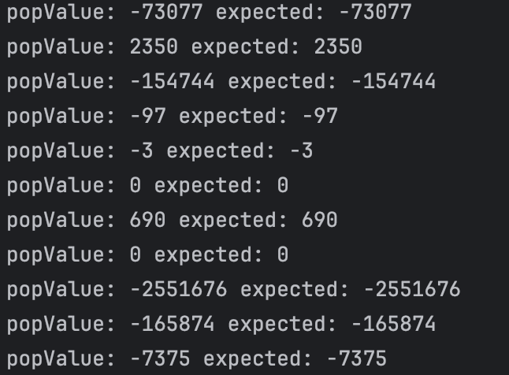

# Testing the heap property

A [*binary heap*](https://en.wikipedia.org/wiki/Binary_heap) is a data structure that contains comparable objects and it is able to efficiently return the lowest element.
This data structure relies on a binary tree to keep the insertion and deletion operations efficient. It is the base of the [*Heapsort* algorithm](https://en.wikipedia.org/wiki/Heapsort).

Implement a `BinaryHeap` class with the following interface:

```java
class BinaryHeap<T> {

    public BinaryHeap(Comparator<T> comparator) { ... }

    public T pop() { ... }

    public T peek() { ... }

    public void push(T element) { ... }

    public int count() { ... }

}
```

A `BinaryHeap` instance is created using a `Comparator` object that represents the ordering criterion between the objects in the heap.
`pop` returns and removes the minimum object in the heap. If the heap is empty it throws a `NotSuchElementException`.
`peek` similar to `pop`, returns the minimum object but it does not remove it from the `BinaryHeap`.
`push` adds an element to the `BinaryHeap`.
`count` returns the number of elements in the `BinaryHeap`.

With the help of [jqwik](https://jqwik.net/) create a test that generates random inputs for your heap and ensures that the element returned by `pop` every time it is invoked is the minimum of the remaining elements in the heap.


**NOTE:** 
- Do not use any existing implementation, write your own code. 
- Use the provided project template as a starting point. 
- In the project you can launch the tests with `mvn test`.
- You may reuse your binary heap code from the previous practical assignment.


## Answer ##

Pour cette partie, le test a été plutôt rapide à faire car il correspond à une situation précise.
Nous avons décidé de comparer à chaque fois le minimum d'une Collection avec le résultat de la méthode pop pour une même liste donnée puis de la supprimer, ceci est répété jusqu'à ce que les "listes" soit vide.

Résultat du test :



Ce test nous à permis de comprendre qu'il ne fallait pas simplement supprimé la valeur minimum de l'arborecense mais qu'il fallait vérifier que la valeur qui la remplace soit bien à nouveau la valeur minimale.

Correction d'erreur comme:
- heap.remove(heap.size()); au lieu de heap.remove(heap.size() - 1);
- oubli de mettre !heap.isEmpty()

