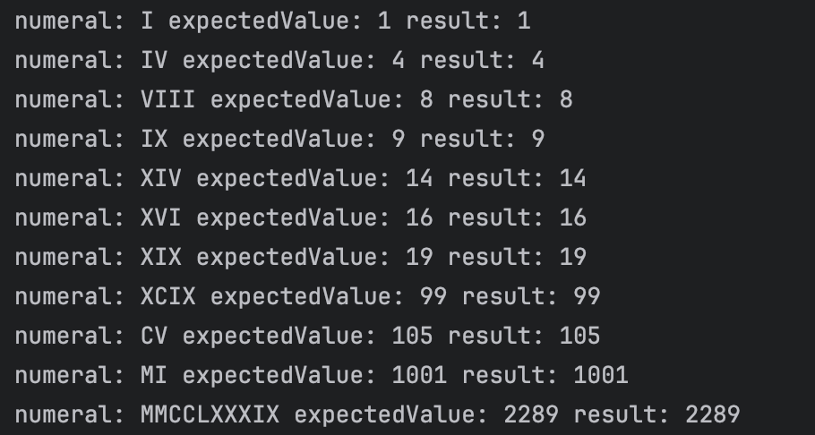
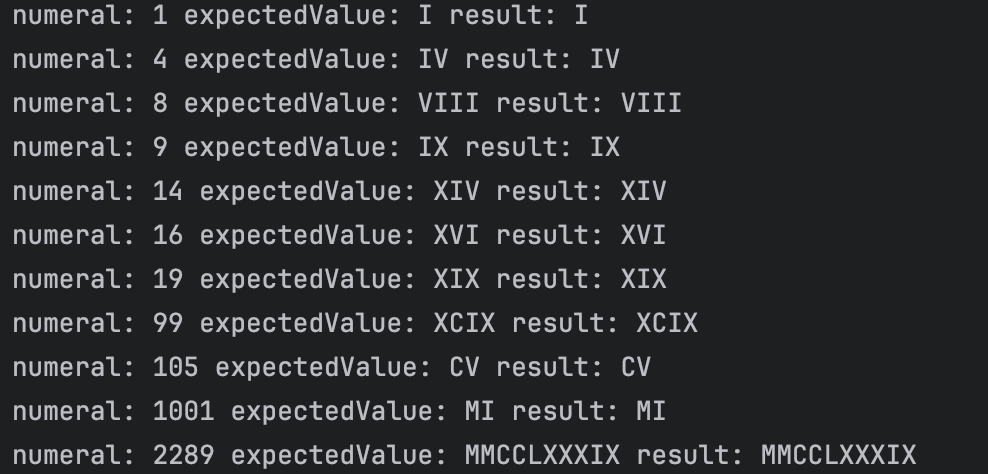

# Roman numerals

Any natural number between 0 and 3999 can be represented in *roman numerals* using the following rules:

1. Only symbols *M*, *D*, *C*, *X*, *V*, *I* can be used. Their values are shown below:

    |   M  |  D  |  C  | L  |  X | V | I |
    |------|-----|-----|----|----|---|---|
    | 1000 | 500 | 100 | 50 | 10 | 5 | 1 |

2. Symbols M, C, X, I can be repeated consecutively up to three times.
3. Symbols D, L and V can not be repeated.
4. When a symbol of lower value of appears to the right of a symbol of equal or higher value, all symbol values are added.
5. When a symbols of lower value appears to the left of a symbols of higher value, the lower value is subtracted from the higher value. Only symbols C, X, V can be subtracted. Each symbol can be subtracted only once. The subtracted symbol must be one fifth or one tenth of the larger.

*Examples:*

-    1 = I
-    4 = IV
-    8 = VIII
-    9 = IX
-   14 = XIV
-   16 = XVI
-   19 = XIX
-   99 = XCIX
-  105 = CV
- 1001 = MI
- 2289 = MMCCLXXXIX

Implement the following methods in the `RomanNumeralUtils` class:

```java
class RomanNumeralUtils {

    public static boolean isValidRomanNumeral(String value) { ... }

    public static int parseRomanNumeral(String numeral) { ... }

    public static String toRomanNumeral(int number) { ... }

}
```

Use [jqwik](https://jqwik.net/) to create property based tests verifying these three methods. Create the tests before implementing the methods. Document any bugs you found with the help of these tests during the process.

**NOTE:** 
- Do not use any existing implementation, write your own code. 
- Use the provided project template as a starting point.
- In the project you can launch the tests with `mvn test`.

## Answer ##

Nous avons commencé par faire les tests en premier en commancant par le test de isValidRomanNumeral. 
Pour ce test nous avons ajouté un ensemble de propriétés à respecter en utilisant ceux donner dans le sujet puis nous l'avons lancé avec différents chiffres romains générés aléatoirement (des bons et des mauvais).
Si la fonction isValidRomanNumeral est bon c'est qu'elle retourne le même résultat que le test qui respectent toutes les propriétés.
Pour le test des deux autres fonctions nous avons simplement créé un jeu de test avec le chiffre romain et la valeur numérique associée et nous avons vérifié que les fonctions retournaient bien le bon résultat.

Pour les résultat, les fonctions toRomanNumeral et parseRomanNumeral semble fonctionner correctement.

Résultat parseRomanNumeral:



Résultat toRomanNumeral:



Le fait de faire les tests en premier ne nous à pas beaucoup aidé pour la conception des fonctions car ca n'indique pas le problème mais ca nous à permis de savoir si la fonction était bonne à la fin. Bien que nous n'avons pas eu de difficulté majeur lors de la conception des fonctions.

Pour la fonction isValidRomanNumeral, elle semble fonctionner correctement mais le test associé semble avoir un problème concernant certains chiffres romains mis à vrai alors qu'il n'existe pas.
Ce problème arrive lorsqu'un chiffre devient négatif ou qu'un chiffre est soustrait plusieurs fois par des chiffres inférieurs alors qu'il ne doit être soustrait qu'une fois, nous n'avons pas trouvé comment corriger ce problème.
Les test ou plutôt les propriétés données ont permis de comprendre les différents cas qui peuvent arriver lors de la validation d'un chiffre romain et nous ont permis de savoir facilement quelle règles n'est pas respectées dans la conception du regex.


