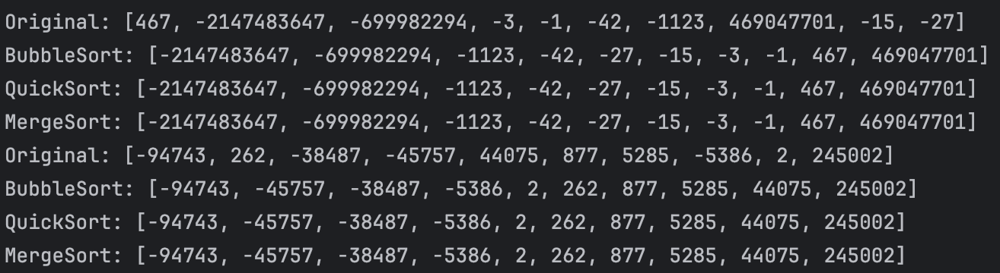

# Sorting algorithms

Implement [Bubble sort](https://en.wikipedia.org/wiki/Bubble_sort), [Quicksort](https://en.wikipedia.org/wiki/Quicksort) and [Merge sort](https://en.wikipedia.org/wiki/Merge_sort) in the `Sorting` class as indicated below. The three methods return a sorted version of the original array. The comparison between the elements of the arrays is specified with an instance of `Comparator`.

```java
class Sorting {

    public static T[] bubblesort(T[] array, Comparator<T> comparator) { ... }

    public static T[] quicksort(T[] array, Comparator<T> comparator)  { ... }

    public static T[] mergesort(T[] array, Comparator<T> comparator) { ... }

}
```

Using [jqwik](https://jqwik.net/) create a differential fuzzing strategy to test the three sorting algorithms at the same time. Create the test before any sorting implementation. Document any bug you find with the help of your tests.


**NOTE:** 
- Do not use any existing implementation, write your own code. 
- Use the provided project template as a starting point.
- In the project you can launch the tests with `mvn test`.

## Answer ##

Pour cette partie, nous avons commencé par écrire le test qui utilise la stratégie de fuzzing différentielle pour tester les trois algorithmes de tri. 
Nous avons utilisé la librairie jqwik pour générer des tableaux aléatoires.
Nous avons ensuite trié ces tableaux avec les trois algorithmes de tri et vérifié que les tableaux triés étaient identiques. 

Résultat :



Hormis le tri à bulle qui était plutôt simple, les deux autres algorithmes de tri étaient plus complexes à implémenter.
Le test implémenté avant, nous a été utile pour voir si nos implémentations étaient correctes et en affichant les valeurs retournées par les fonctions de tris nous avons pu petit à petit comprendre pourquoi les valeurs étaient triées de la mauvaise façon pour ensuite corriger.

A l'aide des tests nous avons pu corriger pleins de petites erreurs comme:
- mettre i-1 au lieu de i
- null pointer exception dans for
- oublie de passer swap à true
- utilisant d'un while au lieu d'un do while
- mauvais paramètre dans l'appel à quicksortRecursive

